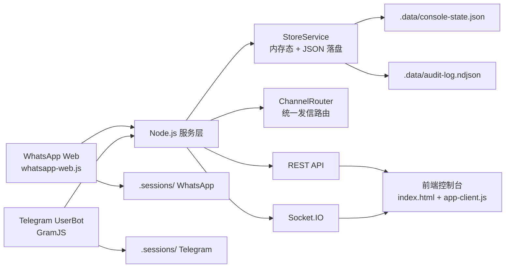

# 跨境供应链调度中台

## 项目操作手册与系统全量说明

本文档的目标不是做一份简单的“用户手册”，而是给**后续接手的 AI / 工程师 / 运维人员**提供完整上下文，让其在阅读后能快速理解：

- 这个项目要解决什么业务问题
- 为什么当前系统会这样设计
- 前后端分别有哪些模块
- 模块之间是如何联动的
- 日常值班如何使用
- 哪些地方是当前版本的重点能力
- 哪些地方是已知边界、后续诊断时必须重点关注

如果后续要让其他 AI 帮忙诊断、优化、部署、审查代码，建议先把这份文档与代码仓库一起提供。

---

## 1. 项目定位

这是一个面向**跨境电商尾货供应链调度**的中控台系统。

系统要同时接管两类实时通讯渠道：

- `WhatsApp`：主要用于海外供应商或部分分销商
- `Telegram UserBot`：主要用于国内分销商或部分供应商

本系统的核心价值不在于“聊天”，而在于把原本散落在多个聊天软件里的消息，统一收口到一个交易式控制台里，辅助值班人员完成：

- 接收供应商下发
- 提取联赛 / 对阵 / 盘口 / 水位
- 快速生成预备单、报价单、回执单
- 按规则批量向不同资源派发
- 根据资源类型、美洲限制、连麦模式、计额规则实时计算缺口
- 降低误触、误发、错单、漏发的风险

---

## 2. 当前业务工作模式

当前系统是按**轮班制单操盘手**模式设计和迭代出来的。

这意味着：

- 当前默认只有一个人主操作
- 不强调“多人同时抢同一张单”
- 更强调“减少误操作”“交班时状态不要丢”“所有参数要落盘”

这也是为什么当前系统采用的是：

- 单一全局 `currentTicket`
- 本地文件持久化
- 中心控制台模式
- 强调安全锁、共享配置、审计日志

而不是一开始就上：

- 多工单认领系统
- 多人协作锁
- 数据库级事务流转

一句话总结：

**当前版本是“高频值班控制台”，不是“完整多人协同工单系统”。**

---

## 3. 设计目标与为什么这样做

### 3.1 为什么做这个系统

在真实业务中，供应商和分销商消息都分散在 WhatsApp / Telegram 中，人工值班常见问题包括：

- 聊天窗口太多，切来切去容易漏单
- 同一条单子需要复制很多次，效率低
- 分销商有的是自动派发，有的是连麦手工派发，逻辑不统一
- 有些资源不能做美洲区，有些可以，人工切换容易出错
- 汇率、跟注额、特殊赛额度这些规则一旦靠脑子记，很容易算错
- 浏览器一清缓存，之前配置全没了

系统的目的就是把这些“人脑记忆”和“临场手工操作”尽可能变成：

- 可视化
- 可重复
- 可持久化
- 可回溯

### 3.2 为什么采用当前技术路线

当前采用的是：

- 前端：原生 `HTML + CSS + JavaScript`
- 后端：`Node.js + Express + Socket.IO`
- WhatsApp：`whatsapp-web.js`
- Telegram：`GramJS UserBot`

这样做的原因：

- 页面是重度操作台，不是营销官网，原生前端更轻，响应更直
- `Socket.IO` 可以实时同步状态，适合控制台
- `WhatsApp Cloud API` 不适合当前“真人接管式”的业务习惯
- `Telegram Bot API` 无法满足个人号接管需求，所以必须走 `UserBot`

### 3.3 为什么不把所有东西做得很“通用”

因为这个项目不是通用 SaaS，而是围绕实际值班动作一步步打磨的：

- 预备单只需要“联赛 + 对阵”
- 回执要生成特定格式
- 美洲单有特殊筛选和特殊目标额度
- 连麦客户不应自动发消息，但金额必须计入
- 有些消息只是反馈水位，不能覆盖整张单

所以当前系统内置了大量**业务规则型联动**，这是刻意设计，不是无意耦合。

---

## 4. 当前技术架构总览



---

## 5. 项目目录与模块职责

### 5.1 根目录关键文件

- [index.html](/Users/imlxw/Desktop/业务调度系统/index.html)
  前端页面结构、主要样式、布局容器

- [app-client.js](/Users/imlxw/Desktop/业务调度系统/app-client.js)
  前端所有核心交互逻辑、状态联动、资源调度、消息提取、按钮行为

- [README.md](/Users/imlxw/Desktop/业务调度系统/README.md)
  项目简版说明

- [DEPLOYMENT.md](/Users/imlxw/Desktop/业务调度系统/DEPLOYMENT.md)
  部署说明

### 5.2 后端入口

- [src/server.js](/Users/imlxw/Desktop/业务调度系统/src/server.js)
  服务启动入口，负责：
  - 初始化 Store
  - 初始化 WhatsApp / Telegram 适配器
  - 创建 HTTP + Socket.IO 服务
  - 监听通道消息并写入当前交易单
  - 优雅退出与状态落盘

- [src/app.js](/Users/imlxw/Desktop/业务调度系统/src/app.js)
  Express 应用装配：
  - Basic Auth 保护
  - API 路由挂载
  - 静态资源托管

### 5.3 路由层

- [src/routes/api-routes.js](/Users/imlxw/Desktop/业务调度系统/src/routes/api-routes.js)
  主要 API 都在这里，负责：
  - 启动数据
  - 通道登录状态
  - 资源 / 源头更新
  - 广播操作
  - 共享配置更新
  - 安全锁拦截

- [src/routes/webhook-routes.js](/Users/imlxw/Desktop/业务调度系统/src/routes/webhook-routes.js)
  当前存在，但不是项目主路径

### 5.4 核心服务

- [src/services/store-service.js](/Users/imlxw/Desktop/业务调度系统/src/services/store-service.js)
  整个系统的状态中枢：
  - 当前交易单
  - 共享配置
  - 供应商绑定
  - 资源绑定
  - 系统日志
  - 审计日志
  - 自动落盘

- [src/services/calculation-service.js](/Users/imlxw/Desktop/业务调度系统/src/services/calculation-service.js)
  所有核心数值计算：
  - 水位解析
  - 最终水位
  - 目标金额
  - 已分配额度
  - 缺口 / 超出额度
  - 回执文本拼接

- [src/services/channel-router.js](/Users/imlxw/Desktop/业务调度系统/src/services/channel-router.js)
  统一发信路由，负责：
  - 向供应商发
  - 向单个资源发
  - 向多个资源广播
  - 拦截 dryRun / 未就绪 / 已停用资源

### 5.5 通道适配器

- [src/adapters/whatsapp-webjs-adapter.js](/Users/imlxw/Desktop/业务调度系统/src/adapters/whatsapp-webjs-adapter.js)
  当前实际生产主链路的 WhatsApp 接管器：
  - 会话持久化
  - 二维码 / 配对码登录
  - 消息收发
  - 最近聊天发现
  - 发送队列
  - 掉线恢复与健康检查

- [src/adapters/telegram-userbot-adapter.js](/Users/imlxw/Desktop/业务调度系统/src/adapters/telegram-userbot-adapter.js)
  Telegram 个人号接管器：
  - 登录
  - 最近对话发现
  - 消息收发
  - 会话持久化

- [src/adapters/whatsapp-baileys-adapter.js](/Users/imlxw/Desktop/业务调度系统/src/adapters/whatsapp-baileys-adapter.js)
  历史保留模块，当前**不是主生产链路**

### 5.6 基础库

- [src/lib/access-auth.js](/Users/imlxw/Desktop/业务调度系统/src/lib/access-auth.js)
  控制台访问保护

- [src/lib/request-actor.js](/Users/imlxw/Desktop/业务调度系统/src/lib/request-actor.js)
  审计日志中的操作者识别

- [src/lib/secure-session-store.js](/Users/imlxw/Desktop/业务调度系统/src/lib/secure-session-store.js)
  Telegram 会话落盘与加密支持

- [src/socket/register-socket.js](/Users/imlxw/Desktop/业务调度系统/src/socket/register-socket.js)
  Socket 推送快照

---

## 6. 前端界面模块说明

当前页面从左到右大致分成三大栏。

---

### 6.1 左侧：源头情报池

作用：

- 显示当前选中的供应商
- 展示最近收到的源头消息
- 提供“提取到中控台”入口
- 提供快捷回复
- 展示下游反馈、源头反馈
- 管理 WA / TG 接管状态
- 进行最近会话发现与绑定

为什么这样设计：

- 值班人员最先关注的是“源头刚刚发了什么”
- 所有后续动作都从这条消息开始
- 所以消息必须放在左侧固定位置，减少视线切换

主要子模块：

- 供应商选择器
- 最新消息面板
- `提取到中控台`
- 快速回复供应商
- 下游反馈框
- 源头反馈框
- 通道接管区
- 最近发现会话与绑定区

---

### 6.2 中间：交易控制中心

作用：

- 作为当前唯一交易单的操作主区
- 承接“从消息提取出来的结构化信息”
- 管理联赛、对阵、盘口、水位、退点、目标额度、汇率等核心变量
- 提供预备单、报价单、快捷指令和安全锁等高频动作

为什么这样设计：

- 当前版本是单操盘手模式
- 交易单必须有唯一且明确的“当前上下文”
- 所有广播动作都基于这一区域的内容生成

主要字段：

- 联赛
- 对阵队伍
- 盘口文本
- 提取水位
- 扣除退点
- 最终回执水位
- 常规赛额度
- 特殊赛额度
- 跟注额
- 当前汇率
- 美洲订单开关
- 目标金额 / 已分配额度 / 未分配缺口（或超出额度）

主要按钮：

- 发预备单
- 发报价
- 快捷指令
- 复制报价
- 生成汇总
- 安全锁

---

### 6.3 右侧：资源调度区

作用：

- 管理所有资源
- 决定当前单要发给谁
- 决定哪些资源只计额不自动发送
- 决定哪些资源不能做美洲
- 管理币种、条数、浮动/固定、回执

为什么这样设计：

- 真正的调度动作发生在这里
- 值班人员需要一眼看到：
  - 当前有哪些资源
  - 哪些启用
  - 哪些发
  - 哪些只计额
  - 哪些是连麦
  - 哪些不做美洲

主要字段：

- 资源绑定
- 发送
- 计额
- 连麦
- 美洲
- 交货额度
- 币种 `U / RMB`
- 条数
- 分配类型 `固定 / 浮动`
- 预备 / 盘口 / 回执 / 删除
- 启用 / 停用

---

### 6.4 右下：专属回单生成器

作用：

- 针对单个资源快速生成回执
- 自动带入当前联赛、对阵、盘口和最终水位
- 允许修改确认金额、条数、最终水位
- 一键发送或复制文本

为什么这样设计：

- 回执往往是高频且格式敏感的动作
- 不能要求值班人员每次手打

---

## 7. 消息分类逻辑

系统对源头消息不是“见字就提取”，而是做了分类。

这是当前项目非常重要的一块，因为它决定了**什么能覆盖中控台，什么不能覆盖**。

### 7.1 `prep_ticket` 预备单

典型格式：

```text
意大利甲组联赛
卡利亚里 v 那不勒斯
```

处理方式：

- 自动提取到中控台
- 只覆盖：
  - 联赛
  - 对阵
- 不生成盘口和水位

为什么：

- 预备单本来就没有盘口
- 如果保留旧盘口，会把上一场的盘口错带到新单

### 7.2 `market_ticket` 正式盘口单

典型格式：

```text
意大利甲组联赛
卡利亚里 v 那不勒斯
大 2 @ 0.88
```

处理方式：

- 自动提取到中控台
- 覆盖：
  - 联赛
  - 对阵
  - 盘口文本
  - 原始水位

### 7.3 `source_receipt` 源头回单 / 确认单

典型格式：

```text
1.意大利甲组联赛
卡利亚里 v 那不勒斯
大 2 @ 0.88 确10000
```

处理方式：

- 不自动覆盖中控台
- 只显示在源头消息区

为什么：

- 这种消息是对已下发盘口的确认，不是新的源头单
- 如果用它覆盖中控台，会把原来未退点前的单子破坏掉

### 7.4 `feedback_signal` 水位反馈

典型格式：

- `0.99`
- `0.99拿`
- `0.99收`
- `0.99了`

处理方式：

- 不覆盖中控台
- 进入左侧反馈区

为什么：

- 这类消息只是价格反馈，不是完整交易单

---

## 8. 关键业务联动说明

这一节非常重要，因为其他 AI 在诊断时最容易忽略“某个动作看起来只是改 UI，实际上会影响很多联动”。

---

### 8.1 源头消息 -> 中控台提取

联动链路：

1. WA / TG 收到消息
2. 后端写入 `currentTicket.sourceMessage`
3. Socket 推送给前端
4. 前端分析消息类型
5. 如果是 `prep_ticket` 或 `market_ticket`
6. 才允许自动提取到中控台

影响：

- 当前联赛
- 当前对阵
- 当前盘口
- 当前原始水位
- 美洲订单判断
- 资源自动预置逻辑

---

### 8.2 联赛识别 -> 美洲订单判断

系统会根据联赛文本判断是否为美洲订单。

如果是美洲订单：

- 目标金额切换为：`特殊赛额度 + 跟注额`
- 不能接美洲的资源会被临时取消发送 / 计额

如果不是美洲订单：

- 目标金额切换为：`常规赛额度 + 跟注额`
- 普通资源恢复正常调度

为什么：

- 美洲单往往有单独额度控制
- 并且资源侧并非所有人都能接

---

### 8.3 资源的 4 个核心状态

每个资源现在至少有以下几个关键维度：

- `enabled`
  是否启用。停用后自动沉底，不参与发送、计额、批量操作。

- `sendEnabled`
  是否参与自动发送。

- `includeInAllocation`
  是否计入已分配额度。

- `liveDispatch`
  是否为连麦客户。

为什么要分开：

- “发消息”和“算额度”不是一回事
- 连麦客户通常不自动发，但金额必须计入
- 停用资源又比“仅不发送”更进一步，应该完全退出本轮调度

---

### 8.4 连麦资源的联动

连麦资源的逻辑是：

- 不自动发送预备单 / 盘口
- 但金额会计入已分配额度

为什么：

- 这类客户是人工连麦派单，不走系统自动广播
- 但系统仍然需要计算当前已分出去多少额度

---

### 8.5 快捷回复与反馈区的联动

当前左侧有两种反馈：

- 下游反馈
  例如资源反馈 `0.95`
  可以一键“向供应商反馈 0.95”

- 源头反馈
  例如供应商回 `0.98拿`
  可以一键“向资源同步 0.98拿`

这两个反馈框是常驻显示的。

为什么：

- 调价过程经常反复来回
- 值班人员需要把上下游水位快速同步，而不是手打

---

### 8.6 回执联动

回执单生成器会联动：

- 当前联赛
- 当前对阵
- 当前盘口
- 当前最终水位
- 选定资源的默认金额、条数

且“最终水位”是可手改的，修改后会立刻联动下面的回执文本。

为什么：

- 实际业务里，最终确认水位经常会手动调整

---

### 8.7 安全锁

安全锁开启后：

- 前端阻止大多数交互
- 后端也会拦截写操作

作用：

- 防止值班过程中误触
- 尤其是在看盘、截屏、切窗时误点按钮

---

## 9. 共享配置与本地持久化

当前系统已经尽量避免“浏览器缓存一清空，配置全没了”。

### 9.1 当前落盘内容

- [/.data/console-state.json](/Users/imlxw/Desktop/业务调度系统/.data/console-state.json)
  保存：
  - 当前交易单
  - 共享配置
  - 供应商绑定
  - 资源绑定
  - 快捷指令
  - 安全锁状态
  - 汇率 / 特殊赛额度 / 跟注额等

- [/.data/audit-log.ndjson](/Users/imlxw/Desktop/业务调度系统/.data/audit-log.ndjson)
  保存：
  - 登录
  - 绑定
  - 删除
  - 更新
  - 发送动作

- [/.sessions](/Users/imlxw/Desktop/业务调度系统/.sessions)
  保存：
  - WhatsApp 会话
  - Telegram 会话

### 9.2 为什么这样做

因为当前工作模式是轮班制，系统必须尽量保证：

- 重启后还原现场
- 换浏览器也不丢关键配置
- 后续审查时有痕迹

---

## 10. API 与前端的关系

虽然这是一个强前端控制台，但核心状态并不是纯前端内存。

### 10.1 前端主要拉取

- `GET /api/bootstrap`
  获取初始快照

- Socket `bootstrap / snapshot`
  获取实时状态更新

### 10.2 前端主要写入

- `PATCH /api/ticket/current`
  修改当前交易单

- `PATCH /api/console-settings`
  修改共享配置

- `PATCH /api/resources/:id`
  修改资源配置

- `PATCH /api/source-channels/:id`
  修改源头配置

- `POST /api/actions/...`
  发送动作

### 10.3 为什么这样设计

原因是：

- 前端负责操作体验和局部联动
- 服务端负责持久化、广播同步、审计与最小保护

---

## 11. 日常值班操作手册

这一节是偏实际使用视角。

### 11.1 启动系统

```bash
cd /Users/imlxw/Desktop/业务调度系统
npm start
```

打开：

[http://127.0.0.1:3000/index.html](http://127.0.0.1:3000/index.html)

### 11.2 首次接管 WA / TG

在左侧通道接管区：

- WhatsApp
  - 点 `取二维码` 或 `取配对码`
  - 完成登录

- Telegram
  - 填手机号
  - 发验证码
  - 输入验证码
  - 完成登录

### 11.3 绑定会话

在“最近发现的会话”区：

1. 拉取最近会话
2. 搜索目标群 / 联系人
3. 选择身份
4. 写备注
5. 绑定为供应商或资源

### 11.4 正常派单流程

1. 等供应商来消息
2. 系统自动识别是否可提取
3. 如有需要，点 `提取到中控台`
4. 检查联赛 / 对阵 / 盘口 / 水位
5. 检查资源发送 / 计额 / 连麦 / 美洲状态
6. 点：
   - `发预备单`
   - `发报价`
7. 等资源反馈
8. 根据需要向供应商反馈或向资源同步
9. 生成并发送回执

### 11.5 回执流程

1. 在右下选择目标资源
2. 检查金额、条数、最终水位
3. 必要时手改 `最终水位`
4. 检查回执文本
5. 点 `一键发送`

### 11.6 值班防误触

如果只是观察、不想误操作：

1. 点安全锁
2. 看盘结束后再解除

---

## 12. 当前已知边界与诊断重点

这一节是写给后续 AI / 工程师的重点。

### 12.1 当前最重要的架构边界

#### 1. 单全局 `currentTicket`

当前系统只有一张全局当前单。

这意味着：

- 很适合单操盘手轮班制
- 不适合多人同时处理不同单

诊断时若出现“上一张单被冲掉”，先看：

- [src/server.js](/Users/imlxw/Desktop/业务调度系统/src/server.js)
- [app-client.js](/Users/imlxw/Desktop/业务调度系统/app-client.js)

#### 2. 反馈逻辑仍然有文本规则成分

下游反馈、源头反馈、本单识别，仍然有一部分依赖文本规则判断，而不是完整工单 ID 绑定。

如果诊断“为什么识别错了”，先看：

- [app-client.js](/Users/imlxw/Desktop/业务调度系统/app-client.js)
  中的消息分类、反馈解析、提取逻辑

#### 3. WhatsApp 主链路仍是非官方 Web 接管

这意味着：

- 不是 100% 稳定
- 掉线 / 会话失效 / 浏览器上下文损坏 仍有概率出现

诊断时优先看：

- [src/adapters/whatsapp-webjs-adapter.js](/Users/imlxw/Desktop/业务调度系统/src/adapters/whatsapp-webjs-adapter.js)
- `.sessions`
- 运行日志

### 12.2 诊断时建议优先排查的 5 类问题

#### 1. 消息是否真的发送成功

不要只看前端 toast。

要同时确认：

- 通道是否 `ready`
- `ChannelRouter.ensureDelivered()` 是否通过
- 日志是否只是 dryRun

重点文件：

- [src/services/channel-router.js](/Users/imlxw/Desktop/业务调度系统/src/services/channel-router.js)

#### 2. 中控台为什么被覆盖 / 没有覆盖

优先查消息分类：

- 是预备单
- 盘口单
- 源头回单
- 反馈信号
- 普通聊天

重点文件：

- [app-client.js](/Users/imlxw/Desktop/业务调度系统/app-client.js)

#### 3. 为什么某个资源没有被计额 / 没有自动发送

先看这几个状态：

- `enabled`
- `sendEnabled`
- `includeInAllocation`
- `liveDispatch`
- `canAmericas`
- 当前是否美洲单

重点文件：

- [app-client.js](/Users/imlxw/Desktop/业务调度系统/app-client.js)
- [src/services/calculation-service.js](/Users/imlxw/Desktop/业务调度系统/src/services/calculation-service.js)
- [src/services/channel-router.js](/Users/imlxw/Desktop/业务调度系统/src/services/channel-router.js)

#### 4. 为什么清浏览器后配置没了 / 还在

先分清：

- 浏览器本地暂存
- 服务端共享配置
- JSON 落盘配置

重点文件：

- [src/services/store-service.js](/Users/imlxw/Desktop/业务调度系统/src/services/store-service.js)
- [/.data/console-state.json](/Users/imlxw/Desktop/业务调度系统/.data/console-state.json)

#### 5. 为什么安全锁锁住了

前后端都有锁。

重点文件：

- [src/routes/api-routes.js](/Users/imlxw/Desktop/业务调度系统/src/routes/api-routes.js)
- [app-client.js](/Users/imlxw/Desktop/业务调度系统/app-client.js)

---

## 13. 为什么很多规则看起来“业务味很重”

这是刻意的。

当前系统不是追求纯抽象，而是优先满足这些具体需求：

- 供应商消息并不总是规范 JSON，而是自然文本
- 回单和新单长得很像，但业务意义完全不同
- 连麦客户必须计额但不能自动发
- 美洲单和常规单的规则不同
- 一线值班人员需要一眼看出：
  - 是否缺口
  - 是否超出
  - 当前该发给谁
  - 哪些资源被停用

所以系统里存在很多“规则型联动”，这是业务中台常见情况，不是简单的 UI 堆叠。

---

## 14. 如果后续要继续迭代，建议优先级

如果将来继续开发，我建议按下面顺序推进：

### 第一优先级

- 工单模型从单一 `currentTicket` 升级为多工单
- 增加工单认领锁

### 第二优先级

- 把文本规则识别进一步升级成更清晰的消息类型识别器
- 给反馈 / 回单 / 新盘口加更稳的判定

### 第三优先级

- 把 JSON 持久化升级到数据库
- 做审计查询页面

### 第四优先级

- 做角色权限
- 做更完整的团队协作

---

## 15. 给后续 AI 的一句话总结

这个项目不是普通聊天工具，也不是标准 CRM。

它是一个围绕**“供应商下发 -> 中控台提取 -> 资源调度 -> 水位反馈 -> 回执发送”**闭环打造的值班操作台。

理解这个项目时，最重要的不是先看页面，而是先理解这 4 条：

1. 当前系统是**单全局交易单**模型
2. 很多行为由**消息分类规则**驱动
3. 资源调度依赖多个布尔状态的组合，而不是一个“是否发送”开关
4. 当前设计优先服务于**轮班值班与防误操作**

只要理解了这四点，再看代码就会顺很多。

---

## 16. 参考文件

- 项目简要说明：[README.md](/Users/imlxw/Desktop/业务调度系统/README.md)
- 部署说明：[DEPLOYMENT.md](/Users/imlxw/Desktop/业务调度系统/DEPLOYMENT.md)
- 前端主逻辑：[app-client.js](/Users/imlxw/Desktop/业务调度系统/app-client.js)
- 前端页面：[index.html](/Users/imlxw/Desktop/业务调度系统/index.html)
- 服务入口：[src/server.js](/Users/imlxw/Desktop/业务调度系统/src/server.js)
- 状态中心：[src/services/store-service.js](/Users/imlxw/Desktop/业务调度系统/src/services/store-service.js)
- 计算服务：[src/services/calculation-service.js](/Users/imlxw/Desktop/业务调度系统/src/services/calculation-service.js)
- 通道路由：[src/services/channel-router.js](/Users/imlxw/Desktop/业务调度系统/src/services/channel-router.js)
- WhatsApp 适配器：[src/adapters/whatsapp-webjs-adapter.js](/Users/imlxw/Desktop/业务调度系统/src/adapters/whatsapp-webjs-adapter.js)
- Telegram 适配器：[src/adapters/telegram-userbot-adapter.js](/Users/imlxw/Desktop/业务调度系统/src/adapters/telegram-userbot-adapter.js)

